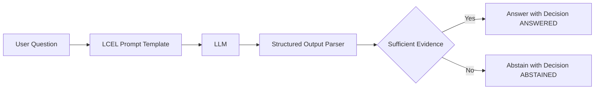
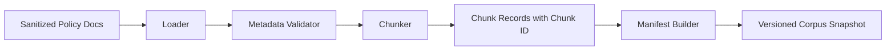
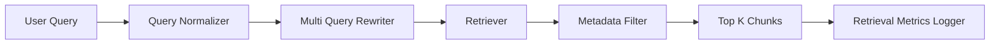
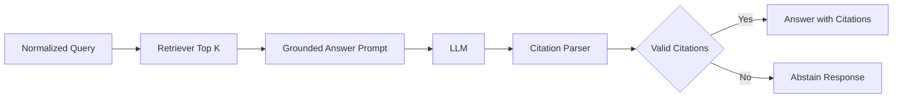
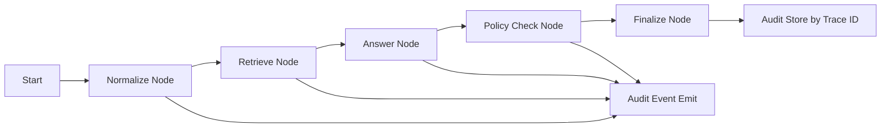
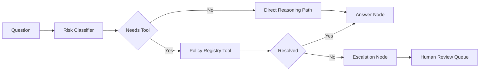
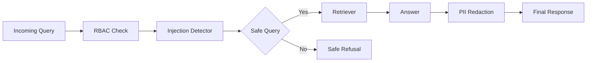
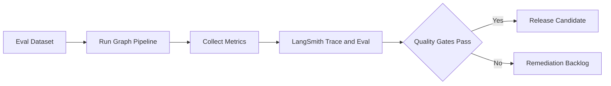
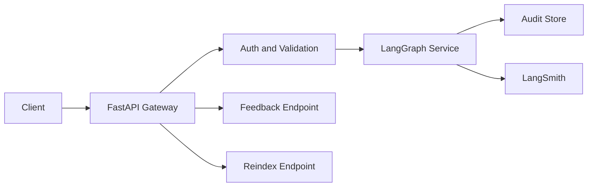
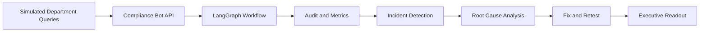

# Technical Implementation Plan: 10-Week Compliance Q&A Bot Curriculum (LangChain-Centric)

## Summary
This plan converts `/Users/perryhe/Projects/langchain-learning/compliance-qa-10-week-plan.md` into a decision-complete, week-by-week technical build path.  
It preserves the original curriculum scope and adds concrete implementation detail: repo modules, APIs, schemas, LangChain/LangGraph workflows, test matrices, and one render-safe Mermaid diagram per week.

## Target Artifact
1. Create a new file: `/Users/perryhe/Projects/langchain-learning/compliance-qa-10-week-technical-plan.md`.
2. Put the complete technical plan (sections below) into that file.
3. Keep weekly ordering and outcomes aligned to the original curriculum file.

## Global Technical Baseline

### Tech Stack
1. Python 3.11.
2. FastAPI for service layer.
3. Pydantic v2 for schemas.
4. LangChain core + community integrations.
5. LangGraph for stateful orchestration.
6. Vector store abstraction with swappable backend.
7. LangSmith tracing and evaluations.
8. Pytest for automated testing.

### Proposed Repository Layout
1. `/Users/perryhe/Projects/langchain-learning/src/compliance_bot/api/`
2. `/Users/perryhe/Projects/langchain-learning/src/compliance_bot/chains/`
3. `/Users/perryhe/Projects/langchain-learning/src/compliance_bot/graph/`
4. `/Users/perryhe/Projects/langchain-learning/src/compliance_bot/retrieval/`
5. `/Users/perryhe/Projects/langchain-learning/src/compliance_bot/ingestion/`
6. `/Users/perryhe/Projects/langchain-learning/src/compliance_bot/guardrails/`
7. `/Users/perryhe/Projects/langchain-learning/src/compliance_bot/tools/`
8. `/Users/perryhe/Projects/langchain-learning/src/compliance_bot/audit/`
9. `/Users/perryhe/Projects/langchain-learning/src/compliance_bot/evals/`
10. `/Users/perryhe/Projects/langchain-learning/tests/`
11. `/Users/perryhe/Projects/langchain-learning/docs/`

### Cross-Cutting Engineering Rules
1. All answers must either cite evidence or abstain/escalate.
2. All major stages emit `AuditEvent`.
3. `trace_id` must be end-to-end propagated.
4. Retrieval must be metadata-filter aware (`jurisdiction`, `policy_scope`, `role`).
5. Provider-specific model settings must stay behind adapter interfaces.

## Important API, Interface, and Type Additions

### HTTP APIs
1. `POST /v1/compliance/query`
   - Request: `ComplianceQueryRequest`
   - Response: `ComplianceQueryResponse`
2. `POST /v1/compliance/feedback`
   - Request: `FeedbackRequest`
   - Response: `FeedbackAck`
3. `GET /v1/compliance/audit/{trace_id}`
   - Response: `AuditRecord`
4. `POST /v1/compliance/documents/reindex`
   - Request: `ReindexRequest`
   - Response: `ReindexStatus`

### Core Types
1. `ComplianceQueryRequest`
   - `question: str`
   - `user_id: str`
   - `role: str`
   - `jurisdiction: str`
   - `policy_scope: list[str]`
   - `session_id: str`
2. `ComplianceQueryResponse`
   - `answer: str`
   - `citations: list[Citation]`
   - `confidence: float`
   - `decision: DecisionEnum`
   - `trace_id: str`
   - `requires_human_review: bool`
3. `Citation`
   - `doc_id: str`
   - `section: str`
   - `chunk_id: str`
   - `quote_span: str`
   - `retrieval_score: float`
   - `version: str`
4. `AuditEvent`
   - `event_id: str`
   - `trace_id: str`
   - `stage: str`
   - `timestamp: datetime`
   - `input_hash: str`
   - `output_hash: str`
   - `actor: str`
   - `status: str`
5. `ComplianceAgentState`
   - `question: str`
   - `normalized_query: str`
   - `retrieved_chunks: list[dict]`
   - `citations: list[Citation]`
   - `policy_flags: list[str]`
   - `decision_path: list[str]`
   - `final_answer: str`
   - `audit_events: list[AuditEvent]`
6. `DecisionEnum`
   - `ANSWERED`
   - `ABSTAINED`
   - `ESCALATE`

## Week-by-Week Technical Plan

### Week 1: Business Framing and Baseline Chain
1. Implementation scope
   - Define requirements artifacts and baseline LCEL chain with structured output.
2. Modules
   - `chains/baseline_chain.py`
   - `schemas/query.py`
   - `docs/requirements.md`
3. Build steps
   - Implement prompt template with explicit uncertainty behavior.
   - Add output parser enforcing `answer`, `confidence`, `decision`.
   - Add initial risk register and acceptance criteria table.
4. Tests
   - Unit test: structured response always parseable.
   - Unit test: unknown context triggers `ABSTAINED`.
5. Definition of done
   - Baseline chain executes end-to-end without retrieval and returns policy-safe structure.
6. Mermaid

### Week 2: Ingestion, Metadata Governance, Versioning
1. Implementation scope
   - Build sanitized document ingestion with deterministic versioned manifests.
2. Modules
   - `ingestion/loaders.py`
   - `ingestion/chunker.py`
   - `ingestion/metadata_validator.py`
   - `ingestion/manifest_builder.py`
3. Build steps
   - Ingest documents from approved source folder.
   - Validate required metadata keys and value formats.
   - Chunk with stable chunk IDs and persist manifest snapshot.
4. Tests
   - Unit test: missing metadata field fails validation.
   - Integration test: same corpus produces same manifest hash.
5. Definition of done
   - Reproducible corpus snapshot with version tags and metadata coverage report.
6. Mermaid

### Week 3: Retrieval Foundation
1. Implementation scope
   - Implement production-like retriever with filterable metadata and benchmarking.
2. Modules
   - `retrieval/indexer.py`
   - `retrieval/retriever.py`
   - `retrieval/query_rewriter.py`
   - `retrieval/benchmarks.py`
3. Build steps
   - Build vector index from manifest.
   - Add query rewriting and optional multi-query expansion.
   - Apply metadata filters for jurisdiction/scope.
   - Measure recall@k proxy, latency, and hit quality.
4. Tests
   - Unit test: filters restrict out-of-scope documents.
   - Benchmark test: recall floor and latency ceiling gates.
5. Definition of done
   - Retrieval v1 meets baseline recall and p95 latency target.
6. Mermaid

### Week 4: Citation-First Answering
1. Implementation scope
   - Build retrieval-augmented answer chain with hard citation requirement.
2. Modules
   - `chains/citation_chain.py`
   - `schemas/citation.py`
   - `chains/abstention_policy.py`
3. Build steps
   - Feed top chunks into constrained answer prompt.
   - Parse and validate `Citation` objects.
   - Reject uncited answer generation and force abstain if evidence weak.
4. Tests
   - Unit test: non-abstained answers include at least one valid citation.
   - Unit test: citation references existing chunk/version.
5. Definition of done
   - Hallucination-resistant answer flow with explicit citation schema compliance.
6. Mermaid

### Week 5: LangGraph State and Audit Trail
1. Implementation scope
   - Refactor to LangGraph with deterministic stage transitions and audit events.
2. Modules
   - `graph/state.py`
   - `graph/workflow.py`
   - `audit/events.py`
   - `audit/replay.py`
3. Build steps
   - Define `ComplianceAgentState`.
   - Add nodes: normalize, retrieve, answer, policy-check, finalize.
   - Emit `AuditEvent` at node entry/exit and failure paths.
   - Implement replay by `trace_id`.
4. Tests
   - Integration test: replay reconstructs decision path exactly.
   - Integration test: retries preserve audit continuity.
5. Definition of done
   - Deterministic stateful pipeline with complete traceability.
6. Mermaid

### Week 6: Tooling and Human Escalation
1. Implementation scope
   - Add policy lookup tools and escalation decision node.
2. Modules
   - `tools/policy_registry_tool.py`
   - `tools/exception_log_tool.py`
   - `graph/escalation_node.py`
3. Build steps
   - Define tool contracts and timeout behavior.
   - Add router logic for tool usage conditions.
   - Add escalation rules for high-risk or unresolved queries.
4. Tests
   - Unit test: high-risk intents set `requires_human_review=true`.
   - Integration test: tool timeout triggers safe fallback and audit log.
5. Definition of done
   - Tool-enabled workflow with controlled escalation and rationale capture.
6. Mermaid

### Week 7: Guardrails, RBAC, Sensitive Data Controls
1. Implementation scope
   - Enforce role-aware retrieval and injection-resistant prompting.
2. Modules
   - `guardrails/rbac_filter.py`
   - `guardrails/pii_redactor.py`
   - `guardrails/injection_detector.py`
3. Build steps
   - Apply RBAC filter before retrieval.
   - Redact sensitive entities in logs and optional response views.
   - Add prompt attack detection and safe refusal template.
4. Tests
   - Security test: restricted role cannot access privileged chunks.
   - Security test: prompt injection patterns are blocked or neutralized.
5. Definition of done
   - Policy-compliant response behavior across adversarial and role-varied inputs.
6. Mermaid

### Week 8: Evaluation and Quality Gates
1. Implementation scope
   - Build evaluation harness and release-blocking quality thresholds.
2. Modules
   - `evals/dataset_builder.py`
   - `evals/run_evals.py`
   - `evals/quality_gates.py`
3. Build steps
   - Create labeled eval set from realistic compliance prompts.
   - Run automated faithfulness, citation-validity, latency, escalation metrics.
   - Log runs in LangSmith and produce remediation backlog.
4. Tests
   - Test: gate fails when citation validity below threshold.
   - Test: gate fails when latency or faithfulness breaches limits.
5. Definition of done
   - Objective quality gate in CI-like workflow.
6. Mermaid

### Week 9: Production API and Observability
1. Implementation scope
   - Expose service endpoints with auth, telemetry, and operational runbook.
2. Modules
   - `api/main.py`
   - `api/routes_query.py`
   - `api/routes_audit.py`
   - `api/routes_feedback.py`
   - `api/routes_reindex.py`
   - `docs/runbook.md`
3. Build steps
   - Implement FastAPI routers for all public endpoints.
   - Add request validation and error model.
   - Correlate `trace_id` across app logs and LangSmith traces.
   - Define SLOs and alert conditions.
4. Tests
   - API test: schema validation and response contract compliance.
   - Integration test: `GET /audit/{trace_id}` returns full event chain.
5. Definition of done
   - Internal API deployable with operational diagnostics.
6. Mermaid

### Week 10: Capstone Simulation and Incident Drill
1. Implementation scope
   - Run end-to-end enterprise simulation with incident response and executive reporting.
2. Modules
   - `docs/capstone_scenario.md`
   - `docs/incident_drill.md`
   - `docs/executive_readout_template.md`
3. Build steps
   - Execute scripted workload with benign, adversarial, and policy-update events.
   - Trigger one forced incident and perform root-cause + corrective actions.
   - Produce final architecture dossier and audit evidence bundle.
4. Tests
   - End-to-end drill: all required evidence artifacts generated.
   - Regression test: fixes from incident do not regress key quality gates.
5. Definition of done
   - Stakeholder-ready demo with auditable outcomes and roadmap.
6. Mermaid

## Test Cases and Scenarios (Program-Level)
1. Citation integrity for all non-abstained responses.
2. Faithfulness mapping from claims to retrieved evidence.
3. RBAC isolation across roles and scopes.
4. Reindex regression for version-aware behavior.
5. Escalation correctness under high-risk intents.
6. Prompt injection resilience.
7. Audit replay completeness for any `trace_id`.
8. Latency budget on normal load.
9. Timeout and retrieval-miss safe fallback behavior.
10. Full quarterly-audit simulation pass.

## Rollout and Monitoring Plan
1. Week 1-4 rollout: local development and deterministic fixtures.
2. Week 5-7 rollout: stateful orchestration and security hardening in staging.
3. Week 8-9 rollout: evaluation gates and internal API pre-production checks.
4. Week 10 rollout: controlled simulation, postmortem, and release recommendation.

## Assumptions and Defaults
1. The technical plan remains English-language.
2. Audience is intermediate LLM developers with Python proficiency.
3. Delivery cadence is 3-4 hours class time plus lab weekly.
4. Provider-agnostic model adapter remains mandatory.
5. Synthetic and sanitized compliance corpus is used throughout.
6. LangSmith is available for tracing/evaluation.
7. Deployment target remains internal FastAPI service.
8. One Mermaid diagram is included for every week and uses standard Mermaid syntax only.
9. No changes are made to the original curriculum scope in `/Users/perryhe/Projects/langchain-learning/compliance-qa-10-week-plan.md`.
