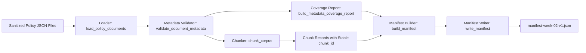

# Week 2 Teaching Script: Ingestion, Metadata Governance, and Corpus Versioning

## Teaching Goal
Build a deterministic ingestion pipeline that transforms sanitized policy documents into a versioned corpus manifest with strict metadata validation, so retrieval work in Week 3 starts from auditable and reproducible inputs.

## Technical Architecture



## Detailed Technical Teaching

### 1. Data Contract First (Schemas)
- Start from explicit contracts in `/Users/perryhe/Projects/langchain-learning/src/compliance_bot/schemas/ingestion.py`.
- `LoadedDocument` normalizes source text + metadata before processing.
- `ChunkRecord` ensures each chunk carries `doc_id`, `version_tag`, and `chunk_index`.
- `CorpusManifest` is the deterministic output used for reproducibility checks.

### 2. Loader Stage
- Module: `/Users/perryhe/Projects/langchain-learning/src/compliance_bot/ingestion/loaders.py`.
- `load_policy_documents(source_dir)` only accepts `*.json` files and enforces object-shaped payloads.
- Metadata is normalized to strings so downstream hashing behavior is stable across input variance.

### 3. Metadata Governance Stage
- Module: `/Users/perryhe/Projects/langchain-learning/src/compliance_bot/ingestion/metadata_validator.py`.
- Required keys: `doc_id`, `effective_date`, `owner`, `jurisdiction`.
- Validation details:
  - `doc_id` must match `^[A-Za-z0-9._-]+$`.
  - `effective_date` must match `YYYY-MM-DD`.
  - `owner` and `jurisdiction` must be non-blank.
- `build_metadata_coverage_report(...)` gives a per-key coverage summary for auditability.

### 4. Deterministic Chunking Stage
- Module: `/Users/perryhe/Projects/langchain-learning/src/compliance_bot/ingestion/chunker.py`.
- `_normalize_text(...)` collapses whitespace before chunking to reduce accidental hash drift.
- `chunk_corpus(...)` sorts documents by `doc_id` + path before chunking.
- `chunk_id` is derived from `version_tag`, `doc_id`, `chunk_index`, and chunk content hash input.

### 5. Manifest Construction Stage
- Module: `/Users/perryhe/Projects/langchain-learning/src/compliance_bot/ingestion/manifest_builder.py`.
- `build_manifest(...)` sorts chunk records deterministically.
- `manifest_hash` is computed from canonical JSON (`sort_keys=True`) to ensure same input => same hash.
- `write_manifest(...)` persists `manifest-<version_tag>.json`.

### 6. Pipeline Entrypoint
- Module: `/Users/perryhe/Projects/langchain-learning/src/compliance_bot/ingestion/pipeline.py`.
- `build_corpus_snapshot(...)` wires the whole flow:
  1. Load documents.
  2. Validate metadata + coverage.
  3. Chunk corpus.
  4. Build manifest.
  5. Write artifact.
- CLI command:

```bash
PYTHONPATH=src python -m compliance_bot.ingestion.pipeline \
  --source-dir docs/policies/sanitized \
  --output-dir artifacts/corpus \
  --version-tag week-02-v1
```

### 7. Testing and Debugging Walkthrough
- Unit guardrail: `/Users/perryhe/Projects/langchain-learning/tests/ingestion/test_metadata_validator.py`
  - Confirms missing required metadata keys fail fast.
- Integration guardrail: `/Users/perryhe/Projects/langchain-learning/tests/ingestion/test_manifest_builder.py`
  - Confirms same corpus and version tag produce the same manifest hash.
- Run:

```bash
.venv/bin/pytest -q
```

### 8. Common Mistakes
- Changing chunk sort order silently changes `manifest_hash`.
- Allowing flexible date formats weakens deterministic governance.
- Generating manifests from unsanitized sources breaks reproducibility and auditability.
